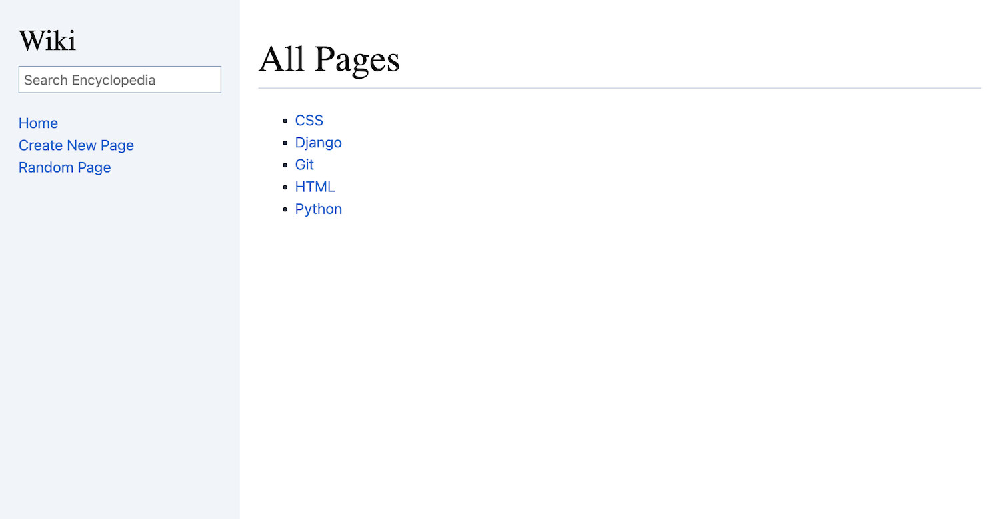

# Wiki

A project to create a Wikipedia-like online encyclopedia using Django and HTML templates as part of the CS50 Web Programming with Python and JavaScript course.

## Features

- The search bar allows users to find entries. Exact matches redirect to the entry page, while partial matches display relevant search results.
- "Create New Page" opens a form for adding a new entry. If the title exists, an error message appears; otherwise, the entry is saved.
- Each entry page has an edit link, it prepopulates a textarea with existing content. Users can save changes.
- "Random Page" redirects users to a random entry.

## Technologies Used

- Django
- Python
- HTML template
- Markdown2
